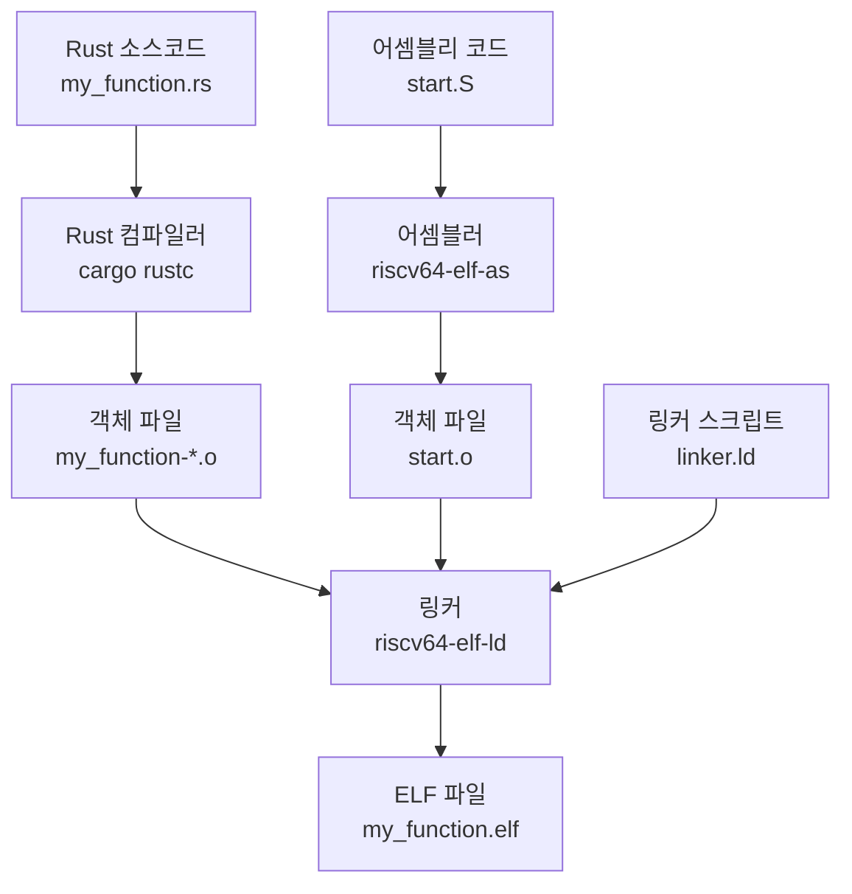
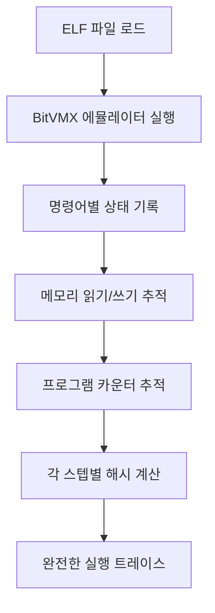
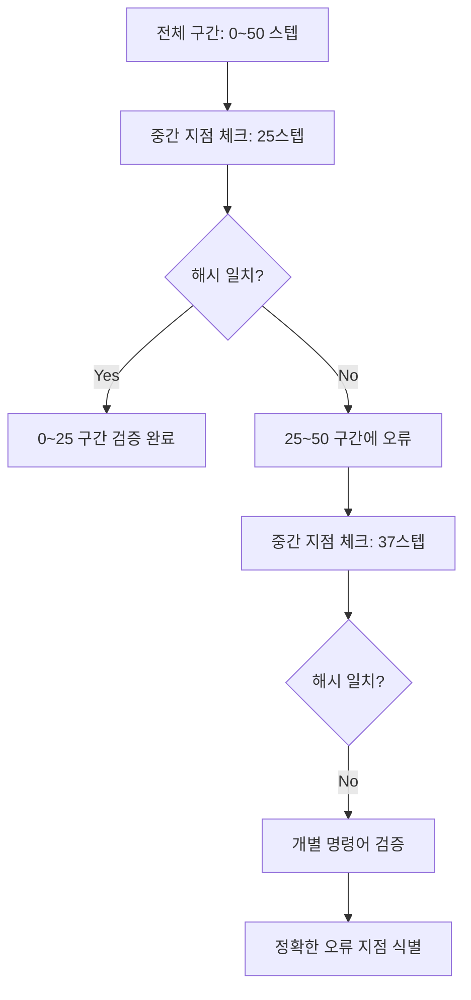
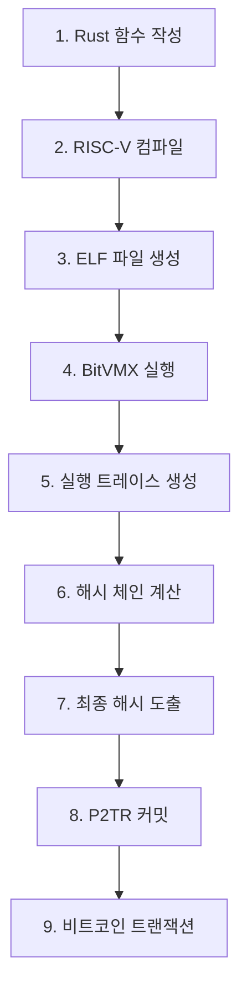

# 🎯 BitVMX 핵심 개념 가이드

> **ELF 파일, 실행 트레이스, 해시 체인의 작동 원리와 비트코인 통합**

---

## 📖 목차

1. [ELF 파일](#-elf-파일)
2. [실행 트레이스](#-실행-트레이스)
3. [해시 체인](#-해시-체인)
4. [비트코인 통합](#-비트코인-통합)
5. [전체 워크플로우](#-전체-워크플로우)

---

## 🔧 ELF 파일

### 📋 **ELF란?**

**ELF (Executable and Linkable Format)**는 RISC-V 프로그램의 실행 가능한 바이너리 형식입니다.

### 🏗️ **생성 과정**



### 💾 **ELF 파일 구조**

```bash
# 1단계: Rust → 객체 파일들
cargo rustc --target riscv32im-unknown-none-elf
# → my_function-xxxxx.o 생성

# 2단계: 어셈블리 → 객체 파일
riscv64-elf-as start.S -o start.o

# 3단계: 링킹 → 하나의 ELF
riscv64-elf-ld -T linker.ld -o my_function.elf start.o my_function-*.o
```

### 📊 **ELF 파일 분석**

| 구성 요소     | 크기         | 설명                           |
| ------------- | ------------ | ------------------------------ |
| **전체 ELF**  | ~2,124바이트 | 헤더 + 메타데이터 포함         |
| **실제 코드** | 216바이트    | text 섹션 (순수 RISC-V 명령어) |
| **함수들**    | 모두 포함    | 하나의 ELF에 모든 함수 포함    |

**메모리 맵:**

```
ROM:        216 B    # 실제 코드 (모든 함수 포함)
RAM:          0 B    # 사용 안함
INDATA:    4 KB      # 입력 데이터 영역
OUTDATA:   4 KB      # 출력 데이터 영역
STACK:     8 MB      # 스택 영역
```

**심볼 테이블:**

```bash
80000000 T _start                 # 부트스트랩 진입점
80000018 t main_calculation       # 계산 함수
80000080 T main                  # 메인 함수
```

### 🔄 **파일 형식 변환**

```bash
# ELF → 바이너리 (순수 머신 코드)
riscv64-elf-objcopy -O binary my_function.elf my_function.bin

# ELF → Intel HEX (디버깅용)
riscv64-elf-objcopy -O ihex my_function.elf my_function.hex
```

---

## 📝 실행 트레이스

### 📋 **실행 트레이스란?**

**실행 트레이스**는 프로그램 실행 과정의 모든 단계를 기록한 상세 로그입니다.

### 🔍 **트레이스 구성 요소**

```rust
#[derive(Clone, Debug, Default, Serialize, Deserialize)]
pub struct TraceRWStep {
    pub write_1: TraceWrite,      // 메모리 쓰기 1
    pub write_2: TraceWrite,      // 메모리 쓰기 2
    pub write_pc: ProgramCounter, // 프로그램 카운터
    pub read_1: TraceRead,        // 메모리 읽기 1
    pub read_2: TraceRead,        // 메모리 읽기 2
    pub read_pc: TraceReadPC,     // PC 읽기
}
```

### 🎯 **트레이스 생성 과정**



### 📊 **트레이스 예시**

```bash
# 실행 명령어
cargo run --release -p emulator execute \
    --elf "../poc/example/build/my_function.elf" \
    --trace

# 출력 예시
PC: 0x80000000 Micro: 0 Opcode: 0xe0800137 Key: lui
PC: 0x80000004 Micro: 0 Opcode: 0x00010113 Key: addi
PC: 0x80000008 Micro: 0 Opcode: 0x078000ef Key: jal
# ... 총 50개 명령어 실행
```

### 🔧 **트레이스 활용**

1. **검증**: 각 단계의 정확성 확인
2. **디버깅**: 프로그램 실행 흐름 분석
3. **챌린지**: 분쟁 시 특정 단계 검증
4. **해시 체인**: 암호학적 증명 생성

---

## 🔒 해시 체인

### 📋 **해시 체인이란?**

**해시 체인**은 실행 트레이스의 각 단계를 SHA-256으로 연결한 암호학적 증명 체계입니다.

### 🧮 **해시 계산 과정**

```rust
pub fn compute_step_hash(
    hasher: &mut Hasher,
    previous_hash: &[u8; 20],        // 이전 단계 해시
    write_trace: &Vec<u8>,           // 현재 단계 트레이스
) -> [u8; 20] {
    hasher.reset();
    hasher.update(previous_hash);     // 이전 해시 포함
    hasher.update(write_trace);       // 현재 트레이스 포함
    let mut output = [0u8; 20];
    hasher.finalize_xof().fill(&mut output);
    output
}
```

### 🔗 **체인 구조**


### 🎯 **해시 체인 생성**

```bash
# 초기 해시 생성
initial_hash = SHA256("ff")[0:20]

# 각 단계별 해시 계산
for step in execution_trace:
    current_hash = BLAKE3(previous_hash + step_trace)[0:20]
    previous_hash = current_hash

# 최종 해시
final_hash = current_hash  # f21f2aad19945c3e830203442d21605872e211c7
```

### 🛡️ **보안 특성**

1. **무결성**: 한 단계라도 변경되면 최종 해시 변경
2. **연결성**: 모든 단계가 암호학적으로 연결
3. **검증 가능**: 누구나 같은 입력으로 동일한 해시 생성 가능
4. **효율성**: 전체 실행을 20바이트 해시로 압축

### 🔍 **해시 검증**

```rust
pub fn validate_step_hash(
    hash: &str,           // 이전 단계 해시
    step: &TraceStep,     // 현재 단계 트레이스
    next_hash: &str       // 다음 단계 해시
) -> bool {
    let computed = compute_step_hash(&hash, &step.to_bytes());
    computed == next_hash
}
```

---

## ⛓️ 비트코인 통합

### 📋 **P2TR 커밋**

최종 해시는 **P2TR (Pay-to-Taproot)** 스크립트를 통해 비트코인 블록체인에 커밋됩니다.

```bash
# BitVM(X) Example P2TR 커밋 스크립트
# 스택: [해시]
OP_SHA256
OP_PUSHDATA1 20
# 예상 최종 해시
f21f2aad19945c3e830203442d21605872e211c7
OP_EQUAL
# 성공 시 1 반환
OP_1
```

### ⚔️ **챌린지 시스템**

```bash
# 챌린지 스크립트
# 스택: [이전_해시] [트레이스_스텝] [다음_해시]
OP_SWAP
OP_SHA256
OP_SWAP
OP_EQUAL
# 검증 성공 시 1 반환
OP_1
```

### 🎯 **N-ary 검색 과정**



---

## 🔄 전체 워크플로우

### 📊 **단계별 과정**



### 🎯 **실제 예시 (poc/example)**

```bash
# 입력
A = 123, B = 456

# 계산
result = 123 × 456 + 42 = 56130

# 실행
50개 RISC-V 명령어 실행

# 해시 체인
50단계 해시 체인 생성

# 최종 해시
f21f2aad19945c3e830203442d21605872e211c7

# 비트코인 커밋
P2TR 스크립트로 블록체인에 기록
```

### 📈 **성능 메트릭**

| 메트릭            | 값        | 설명               |
| ----------------- | --------- | ------------------ |
| **바이너리 크기** | 216바이트 | 세계 최소 수준     |
| **실행 스텝**     | 50개      | RISC-V 명령어      |
| **해시 체인**     | 50단계    | SHA-256 연결       |
| **챌린지 라운드** | ~6라운드  | log₂(50) 이진 검색 |
| **메모리 효율성** | ROM 0.33% | 매우 효율적        |

---

## 🎉 **핵심 이점**

### 🔐 **보안**

- 암호학적으로 검증 가능한 실행
- 변조 불가능한 해시 체인
- 분산 검증 시스템

### ⚡ **효율성**

- 초소형 바이너리 (216바이트)
- 빠른 검증 (상수 시간)
- 최소 온체인 데이터

### 🎯 **검증 가능성**

- 누구나 실행 재현 가능
- 투명한 계산 과정
- 완전한 온체인 검증

### 🌍 **탈중앙화**

- 중앙 서버 불필요
- 순수 블록체인 기반
- 무신뢰 시스템

---

**🎯 BitVMX는 비트코인의 제한된 스크립팅 능력을 뛰어넘어 복잡한 계산을 안전하고 효율적으로 검증할 수 있는 혁신적인 시스템입니다.**

---

_Generated by BitVMX Core Concepts Guide v1.0_
