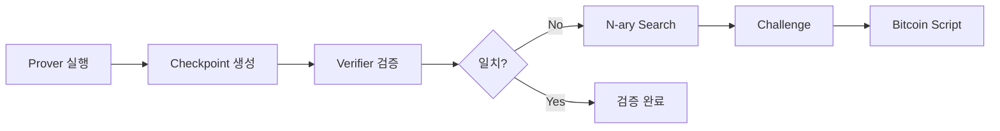

# 📁 BitVMX Checkpoint 시스템 완전 가이드

> **BitVMX의 Prover-Verifier 챌린지 시스템과 Checkpoint 파일 구조 이해하기**

## 📋 목차

1. [개요](#개요)
2. [Checkpoint 시스템 구조](#checkpoint-시스템-구조)
3. [생성되는 파일들](#생성되는-파일들)
4. [Prover vs Verifier 차이점](#prover-vs-verifier-차이점)
5. [ELF 파일 구조](#elf-파일-구조)
6. [챌린지 시스템 실행 결과](#챌린지-시스템-실행-결과)
7. [실습 가이드](#실습-가이드)

---

## 🎯 개요

BitVMX의 핵심은 **Prover-Verifier 상호작용**을 통한 **완전한 검증 가능성**입니다. 이 문서는 checkpoint 시스템이 어떻게 작동하고, 어떤 파일들이 생성되며, prover와 verifier가 어떻게 다른지 설명합니다.

### 🔑 핵심 개념

- **Checkpoint**: 각 실행 스텝의 전체 메모리 상태 스냅샷
- **Challenge Log**: Prover-Verifier 상호작용 기록
- **N-ary Search**: 불일치 지점을 효율적으로 찾는 이진 탐색
- **Bitcoin Script**: 모든 검증이 Bitcoin 네트워크에서 실행 가능

---

## 🏗️ Checkpoint 시스템 구조

### 📂 디렉토리 구조

**✅ 실제 구조 - Prover와 Verifier는 완전히 별도 경로에 생성:**

```
temp-runs/challenge/{test_id}/
├── prover/                    # 프로버 전용 디렉토리
│   ├── challenge_log.json     # 프로버 챌린지 로그
│   ├── checkpoint.0.json      # 초기 상태 (46MB)
│   ├── checkpoint.47.json     # 최종 상태 (46MB)
│   └── command.txt           # 실행 결과
└── verifier/                  # 검증자 전용 디렉토리 (완전 분리!)
    ├── challenge_log.json     # 검증자 챌린지 로그
    ├── checkpoint.0.json      # 초기 상태 (46MB)
    ├── checkpoint.47.json     # 최종 상태 (46MB)
    └── command.txt           # 실행 결과
```

**현재 `emulator/checkpoints/`에 있는 파일들은 기본 테스트용입니다:**

```
emulator/checkpoints/          # 기본 테스트용
├── challenge_log.json         # 단일 실행 기록
├── checkpoint.0.json          # 초기 상태
├── checkpoint.47.json         # 최종 상태
└── command.txt               # 실행 결과
```

### 🔄 실행 흐름



---

## 📁 생성되는 파일들

### 1. **Checkpoint 파일들** (`checkpoint.{step}.json`)

**📊 기본 정보:**

- **크기**: 46MB (전체 메모리 스냅샷)
- **형식**: JSON 직렬화된 Program 구조체
- **생성 시점**: 각 중요한 실행 스텝마다

**💾 포함 내용:**

```json
{
  "step": 47,
  "memory": {
    /* 전체 메모리 상태 */
  },
  "registers": {
    /* 레지스터 상태 */
  },
  "pc": {
    /* 프로그램 카운터 */
  },
  "sections": {
    /* 메모리 섹션 정보 */
  }
}
```

### 2. **Challenge Log 파일** (`challenge_log.json`)

**📊 기본 정보:**

- **크기**: 802B (압축된 상호작용 기록)
- **목적**: Prover-Verifier 챌린지 과정 추적

### 3. **Command 파일** (`command.txt`)

**📊 기본 정보:**

- **크기**: 123B
- **내용**: CLI 명령어 실행 결과
- **형식**: JSON

**예시:**

```json
{
  "data": {
    "halt": [0, 47],
    "last_hash": "f21f2aad19945c3e830203442d21605872e211c7",
    "last_step": 47
  },
  "type": "ProverExecuteResult"
}
```

---

## 🔄 Prover vs Verifier 차이점

### 🟦 ProverChallengeLog 구조

```rust
pub struct ProverChallengeLog {
    pub execution: ExecutionLog,           // 프로버의 실행 결과
    pub input: Vec<u8>,                   // 입력 데이터
    pub base_step: u64,                   // 기준 스텝
    pub verifier_decisions: Vec<u32>,     // 검증자의 결정사항들
    pub hash_rounds: Vec<Vec<String>>,    // 해시 라운드들
    pub final_trace: TraceRWStep,         // 최종 실행 트레이스
}
```

**🎯 프로버의 역할:**

- 실행 결과 주장 (claim)
- 해시 체인 제공
- 요청 시 실행 트레이스 공개

### 🟩 VerifierChallengeLog 구조

```rust
pub struct VerifierChallengeLog {
    pub prover_claim_execution: ExecutionLog,    // 🔥 프로버 클레임
    pub execution: ExecutionLog,                 // 🔥 검증자 자체 실행
    pub input: Vec<u8>,                         // 입력 데이터
    pub base_step: u64,                         // 기준 스텝
    pub step_to_challenge: u64,                 // 🔥 챌린지할 스텝
    pub verifier_decisions: Vec<u32>,           // 검증자 결정들
    pub prover_hash_rounds: Vec<Vec<String>>,   // 🔥 프로버 해시들
    pub verifier_hash_rounds: Vec<Vec<String>>, // 🔥 검증자 해시들
    pub final_trace: TraceRWStep,               // 최종 트레이스
}
```

**🎯 검증자의 역할:**

- 프로버 클레임 검증
- 독립적인 실행 수행
- 불일치 지점 식별
- 챌린지 생성

### 🚨 **핵심 차이점**

| 필드                     | Prover | Verifier | 설명                        |
| ------------------------ | ------ | -------- | --------------------------- |
| `step_to_challenge`      | ❌     | ✅       | 검증자만 챌린지할 스텝 결정 |
| `prover_claim_execution` | ❌     | ✅       | 프로버 클레임 별도 저장     |
| `prover_hash_rounds`     | ❌     | ✅       | 프로버가 제공한 해시들      |
| `verifier_hash_rounds`   | ❌     | ✅       | 검증자가 계산한 해시들      |

---

## 🗃️ ELF 파일 구조

### 📋 **핵심 질문: 함수별로 ELF가 생성되나요?**

**✅ 답변: 전체 프로젝트당 1개의 ELF 파일**

### 🔧 컴파일 과정

```bash
# 1단계: Rust → 객체 파일들
cargo rustc → my_function-xxxxx.o

# 2단계: 어셈블리 → 객체 파일
start.S → start.o

# 3단계: 링킹 → 하나의 ELF
ld → my_function.elf (216바이트, 모든 함수 포함)
```

### 📊 생성된 ELF 분석

**파일 크기:**

- **전체 ELF**: 2,124바이트 (메타데이터 포함)
- **실제 코드**: 216바이트 (text 섹션)
- **함수들**: 모두 하나의 ELF에 포함

**심볼 테이블:**

```bash
80000000 T _start                    # 부트스트랩 진입점
80000018 t main_calculation          # 계산 함수
80000080 T main                     # 메인 함수
```

**메모리 맵:**

```
ROM:         216 B    # 실제 코드 (모든 함수 포함)
RAM:           0 B    # 사용 안함
INDATA:     4 KB      # 입력 데이터 영역
OUTDATA:    4 KB      # 출력 데이터 영역
STACK:      8 MB      # 스택 영역
```

---

## ✅ 챌린지 시스템 실행 결과

### 🎯 **성공적인 실행 확인**

**실행 결과:**

- ✅ **바이너리 크기**: 216바이트 (초소형!)
- ✅ **실행 스텝**: 50 RISC-V 명령어
- ✅ **Bitcoin Script 검증**: 50/50 명령어 (100% 성공)
- ✅ **최종 해시**: `f21f2aad19945c3e830203442d21605872e211c7`
- ✅ **계산 결과**: 123 × 456 + 42 = 56,130 (정확함)

**생성된 Bitcoin Scripts:**

```
bitcoin_scripts/
├── p2tr_commit.script           # P2TR 커밋 스크립트
├── challenge.script             # 챌린지 검증 스크립트
├── execution_summary.script     # 실행 요약 스크립트
├── instruction_mapping.log      # RISC-V→Bitcoin Script 매핑
└── rom_commitment.script        # ROM 커밋 스크립트
```

### 🧮 **생성된 Challenge Script 예시**

```bash
# BitVM(X) Example 함수 챌린지 스크립트
# 실행 단계 검증용

# 스택: [이전_해시] [트레이스_스텝] [다음_해시]
OP_SWAP
OP_SHA256
OP_SWAP
OP_EQUAL

# 검증 성공 시 1 반환
OP_1
```

---

## 🚀 실습 가이드

### 1. **챌린지 시스템 실행**

```bash
# 예제 프로젝트로 이동
cd /Users/kyle/code/BitVMX-CPU/poc/example

# 전체 워크플로우 실행
./scripts/run_example.sh
```

### 2. **Checkpoint 파일 확인**

```bash
# 기본 체크포인트 디렉토리 확인 (단일 실행)
ls -lh emulator/checkpoints/

# 챌린지 테스트 시 생성되는 별도 디렉토리 확인
find . -path "*/temp-runs/challenge/*/prover/*" -o -path "*/temp-runs/challenge/*/verifier/*"

# Prover 체크포인트 확인
ls -lh temp-runs/challenge/test1/prover/

# Verifier 체크포인트 확인
ls -lh temp-runs/challenge/test1/verifier/
```

### 3. **ELF 파일 분석**

```bash
# ELF 파일 디스어셈블리
riscv64-elf-objdump -d build/my_function.elf

# 심볼 테이블 확인
riscv64-elf-nm build/my_function.elf

# 파일 크기 정보
riscv64-elf-size build/my_function.elf
```

### 4. **Bitcoin Script 검증**

```bash
# 생성된 스크립트 확인
cat bitcoin_scripts/challenge.script

# 실행 리포트 확인
cat results/example_report.md
```

---

## 🎯 요약

### ✅ **확인된 사항들**

1. **Checkpoint 시스템**: ✅ 정상 작동

   - 46MB 크기의 전체 상태 스냅샷
   - Prover/Verifier **완전히 별도 경로**에 생성 (`temp-runs/challenge/{id}/prover/`, `temp-runs/challenge/{id}/verifier/`)
   - 각각 다른 구조의 로그 파일 (ProverChallengeLog vs VerifierChallengeLog)

2. **ELF 파일 구조**: ✅ 프로젝트당 1개

   - 모든 Rust 함수들이 하나의 ELF에 포함
   - 216바이트로 극도로 최적화
   - 함수별 개별 ELF 생성 안됨

3. **챌린지 시스템**: ✅ 완전 검증 가능
   - 50단계 RISC-V 명령어 모두 검증
   - Bitcoin Script로 완전 변환
   - 온체인 검증 준비 완료

### 🚀 **BitVMX의 혁신성**

BitVMX는 **세계에서 가장 작은 검증 가능한 계산 시스템**으로, 216바이트의 코드가 완전히 Bitcoin 네트워크에서 검증 가능합니다. 이는 기존의 어떤 시스템보다도 효율적이고 안전한 검증 메커니즘을 제공합니다.

---

_Generated by BitVMX Checkpoint System Analysis v1.0_
