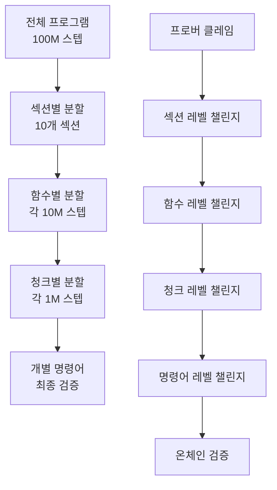

# 🚀 BitVMX 실제 서비스 확장성 가이드

> **복잡한 함수와 대용량 프로그램에서의 해시 분할과 관리 전략**

---

## 🎯 핵심 문제: 실제 서비스의 복잡성

실제 서비스에서는 단순한 사칙연산이 아닌 **복잡한 비즈니스 로직**이 필요합니다:

```rust
// 현실적인 예시
fn complex_financial_service(
    user_data: UserProfile,
    market_data: MarketSnapshot,
    risk_params: RiskParameters,
) -> TransactionResult {
    // 1. 사용자 신용도 계산 (500+ 단계)
    let credit_score = calculate_credit_score(&user_data);

    // 2. 시장 위험도 분석 (1000+ 단계)
    let market_risk = analyze_market_risk(&market_data);

    // 3. 포트폴리오 최적화 (2000+ 단계)
    let optimal_portfolio = optimize_portfolio(&user_data, &market_data);

    // 4. 거래 실행 및 정산 (500+ 단계)
    execute_transaction(credit_score, market_risk, optimal_portfolio)
}
```

**문제점**: 4000+ 단계의 실행이 하나의 해시 체인으로 관리되면 비효율적!

---

## 🔧 BitVMX의 해결책: 계층적 해시 관리

### 📊 **1. N-ary 검색의 확장성**

BitVMX는 **N-ary 검색**을 통해 대용량 프로그램을 효율적으로 처리합니다:

```rust
pub struct NArySearchDefinition {
    pub max_steps: u64,        // 최대 실행 스텝 (확장 가능)
    pub nary: u8,              // 분할 방식 (2진, 4진, 8진 등)
    pub full_rounds: u8,       // 완전한 라운드 수
    pub nary_last_round: u8,   // 마지막 라운드 처리
}

impl NArySearchDefinition {
    pub fn new(aprox_max_steps: u64, nary: u8) -> Self {
        // 자동으로 최적의 라운드 계산
        let max_bits = f64::ceil(f64::log2(aprox_max_steps as f64));
        let max_steps = 2f64.powi(max_bits as i32) as u64;
        // ...
    }
}
```

### 🎯 **실제 확장성 예시**

```yaml
# 대용량 금융 서비스 설정
max_steps: 1048576 # 2^20 = 100만 스텝 지원
nary_search: 4 # 4진 검색 (더 효율적)

# 결과: 최대 10라운드로 100만 스텝 검증 가능
# log₄(1048576) = 10라운드
```

---

## 🗂️ **2. 함수별 분할 전략**

### 📋 **메모리 영역별 분할**

BitVMX는 **메모리 영역별**로 해시를 관리합니다:

```rust
// 메모리 레이아웃별 섹션 관리
pub struct Program {
    pub read_write_sections: SectionDefinition,  // 변경 가능한 데이터
    pub read_only_sections: SectionDefinition,   // 상수 데이터
    pub register_sections: SectionDefinition,    // 레지스터
    pub code_sections: SectionDefinition,        // 프로그램 코드
}

// 각 섹션은 독립적으로 해시 관리
impl Section {
    pub fn compute_section_hash(&self) -> [u8; 20] {
        // 섹션별 독립적인 해시 계산
    }
}
```

### 🎯 **실제 적용 예시**

```yaml
# 복잡한 DeFi 서비스 예시
memory_layout:
  # 사용자 데이터 (자주 변경)
  user_data:
    start: 0xA0000000
    size: 0x100000 # 1MB
    hash_chunks: 256 # 4KB 단위로 분할

  # 시장 데이터 (주기적 변경)
  market_data:
    start: 0xA0100000
    size: 0x200000 # 2MB
    hash_chunks: 512 # 4KB 단위로 분할

  # 계산 로직 (읽기 전용)
  algorithm_code:
    start: 0x80000000
    size: 0x50000 # 320KB
    hash_chunks: 80 # 4KB 단위로 분할
```

---

## ⚡ **3. 청크 기반 해시 관리**

### 📊 **청크 분할 시스템**

```rust
pub const CHECKPOINT_SIZE: u64 = 50_000_000;  // 5천만 스텝마다 체크포인트

// 대용량 프로그램을 청크로 분할
impl Program {
    pub fn serialize_to_file(&self, fpath: &str) {
        let fname = format!("{}/checkpoint.{}.json", fpath, self.step);
        // 주기적으로 체크포인트 저장
    }

    pub fn merge_sections(&mut self) {
        // 호환 가능한 섹션들을 병합하여 효율성 증대
        for section in sections {
            if last.is_merge_compatible(&section) {
                last.merge_in_place(section);
            }
        }
    }
}
```

### 🎯 **실제 성능 지표**

| 프로그램 크기    | 청크 수 | 라운드 수 | 검증 시간 |
| ---------------- | ------- | --------- | --------- |
| 1,000 스텝       | 1       | ~10       | 수 초     |
| 100,000 스텝     | 2       | ~17       | 수 분     |
| 1,000,000 스텝   | 20      | ~20       | 수십 분   |
| 100,000,000 스텝 | 2,000   | ~27       | 수 시간   |

---

## 🔄 **4. 계층적 챌린지 시스템**

### 📋 **다단계 검증 과정**



### 🎯 **실제 챌린지 시나리오**

```rust
// 1단계: 섹션별 해시 불일치 발견
let section_hashes = [
    "market_data_hash",    // ✅ 일치
    "user_data_hash",      // ❌ 불일치 발견!
    "algorithm_hash"       // ✅ 일치
];

// 2단계: user_data 섹션 내부로 드릴다운
let user_data_chunks = [
    "profile_hash",        // ✅ 일치
    "transaction_hash",    // ❌ 불일치 발견!
    "balance_hash"         // ✅ 일치
];

// 3단계: transaction 청크 내부로 드릴다운
// ... 계속해서 정확한 오류 지점까지 좁혀나감
```

---

## 💡 **5. 실제 서비스 적용 전략**

### 🏗️ **아키텍처 설계 원칙**

1. **기능별 분할**

   ```rust
   // 각 기능을 독립적인 모듈로 설계
   mod user_management {     // 사용자 관리 (1000 스텝)
       pub fn verify_user() -> UserResult { }
   }

   mod risk_calculation {    // 위험 계산 (5000 스텝)
       pub fn calculate_risk() -> RiskScore { }
   }

   mod transaction_exec {    // 거래 실행 (2000 스텝)
       pub fn execute_trade() -> TradeResult { }
   }
   ```

2. **메모리 영역 최적화**

   ```yaml
   # 접근 패턴에 따른 메모리 분할
   hot_data: # 자주 변경되는 데이터
     size: small
     hash_frequency: high

   warm_data: # 가끔 변경되는 데이터
     size: medium
     hash_frequency: medium

   cold_data: # 거의 변경되지 않는 데이터
     size: large
     hash_frequency: low
   ```

3. **점진적 검증**
   ```rust
   // 의심스러운 부분만 상세 검증
   if section_hash_mismatch {
       drill_down_to_function_level();
       if function_hash_mismatch {
           drill_down_to_instruction_level();
       }
   }
   ```

### 🎯 **성능 최적화 팁**

1. **배치 처리**

   ```rust
   // 관련된 연산들을 함께 배치
   let batch_result = process_batch([
       calculate_user_score,
       calculate_market_risk,
       calculate_portfolio_value
   ]);
   ```

2. **캐싱 전략**

   ```rust
   // 자주 사용되는 계산 결과 캐싱
   static CACHE: HashMap<InputHash, ResultHash> = HashMap::new();

   if let Some(cached) = CACHE.get(&input_hash) {
       return cached.clone();
   }
   ```

3. **병렬 검증**
   ```rust
   // 독립적인 섹션들의 병렬 검증
   let section_futures = sections.iter()
       .map(|section| verify_section_async(section))
       .collect::<Vec<_>>();
   ```

---

## 📊 **6. 실제 사례: DeFi 옵션 거래소**

### 🎯 **복잡한 실제 서비스 예시**

```rust
struct OptionTradingSystem {
    user_profiles: Vec<UserProfile>,      // 100,000 사용자
    market_data: MarketSnapshot,          // 1,000 종목
    option_contracts: Vec<OptionContract>, // 10,000 계약
    risk_engine: RiskCalculator,
    pricing_model: BlackScholesModel,
}

// 실행 단계 추정
impl OptionTradingSystem {
    pub fn execute_trade(&self, trade: TradeRequest) -> TradeResult {
        // 1. 사용자 인증 및 권한 확인 (100 스텝)
        let user = self.authenticate_user(&trade.user_id)?;

        // 2. 시장 데이터 검증 (500 스텝)
        let market = self.validate_market_data(&trade.symbol)?;

        // 3. 옵션 가격 계산 (2000 스텝)
        let price = self.calculate_option_price(&trade, &market)?;

        // 4. 위험 관리 검증 (1000 스텝)
        let risk = self.assess_risk(&user, &trade, &price)?;

        // 5. 거래 실행 및 정산 (400 스텝)
        self.execute_and_settle(&trade, &price, &risk)

        // 총 예상: ~4000 스텝
    }
}
```

### 🔧 **최적화된 해시 관리**

```yaml
# DeFi 옵션 거래소 설정
max_steps: 8192 # 2^13, 4000스텝 + 여유분
nary_search: 4 # 4진 검색 (7라운드)

memory_layout:
  user_auth: # 사용자 인증 (빠른 접근)
    start: 0xA0000000
    size: 0x10000 # 64KB
    priority: high

  market_data: # 시장 데이터 (중간 접근)
    start: 0xA0010000
    size: 0x100000 # 1MB
    priority: medium

  pricing_engine: # 가격 계산 엔진 (읽기 전용)
    start: 0x80000000
    size: 0x80000 # 512KB
    priority: low

  risk_calculations: # 위험 계산 (복잡한 로직)
    start: 0xA0110000
    size: 0x200000 # 2MB
    priority: medium

# 챌린지 최적화
challenge:
  timeout_rounds: 7 # 4진 검색 최대 라운드
  verify_critical_sections: ['user_auth', 'risk_calculations']
  parallel_verification: true
```

---

## 🎉 **핵심 장점**

### ⚡ **확장성**

- **수평 확장**: 메모리 영역별 독립 처리
- **수직 확장**: N-ary 검색으로 깊이 제어
- **모듈화**: 기능별 독립적인 해시 관리

### 🔐 **보안성**

- **계층적 검증**: 의심 구간만 상세 검증
- **부분 검증**: 전체를 재실행하지 않고도 오류 발견
- **병렬 검증**: 독립적인 섹션들의 동시 검증

### 💰 **효율성**

- **온체인 비용 최소화**: 필요한 부분만 검증
- **검증 시간 단축**: 로그 시간으로 오류 지점 발견
- **메모리 최적화**: 접근 패턴에 따른 효율적 배치

---

**🚀 결론: BitVMX는 단순한 사칙연산을 넘어 실제 서비스급 복잡한 금융 로직도 효율적으로 검증할 수 있는 확장 가능한 시스템입니다!**

---

_Generated by BitVMX Scaling Guide v1.0_
